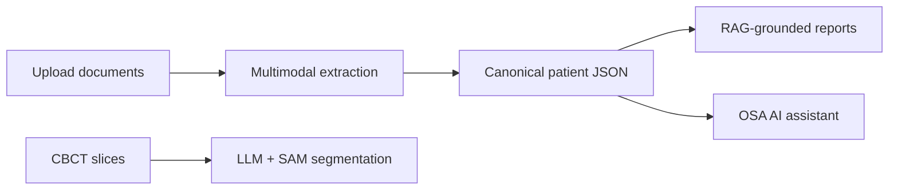

# VizBriz — AI Platform for Obstructive Sleep Apnea (OSA)

VizBriz is an **AI-first clinical platform** for screening, documenting, and reporting on obstructive sleep apnea. It combines multimodal LLMs, retrieval-augmented generation (RAG), and computer vision in a production-style Flask application.

**Competition submission:** AI Talent Hub — ITMO, 2026.

---

## Problem

OSA care is document-heavy: sleep studies (PDF/images), questionnaires, CBCT imaging, and clinical notes arrive in heterogeneous formats. Clinicians need structured observations, risk signals, and consistent reports — not manual copy-paste from PDFs.

## Solution

VizBriz ingests patient documents, extracts structured clinical observations, builds a canonical patient JSON model, and generates multi-level clinical reports grounded in medical knowledge bases.



---

## AI / ML Components

| Component | Technology | Location |
|-----------|------------|----------|
| **Document intelligence** | Claude (Bedrock) + OCR/regex hybrid validation | `flask_app/config/document_observation_extractor_phase2.py` |
| **Sleep study analysis** | GPT-4o vision + PDF (OpenAI Responses API) | `flask_app/config/sleep_study_analysis_pipeline.py` |
| **RAG reports** | Bedrock Knowledge Bases + `retrieve_and_generate` | `flask_app/services/bedrock_service.py`, `flask_app/routes/bedrock_vector_routes.py` |
| **Clinical narratives** | Claude structured JSON generation | `flask_app/services/llm_service.py`, `flask_app/services/l3_autoreport_service.py` |
| **OSA assistant** | Patient-context chat (Dr. Briz) | `flask_app/routes/osaagent_*.py` |
| **Airway imaging** | LLM bbox detection + SAM segmentation | `scripts/llm_segment_cbct_slice.py`, `segmentation/sam_segmentor.py` |
| **Risk screening** | Multilingual OSA questionnaire + LLM narratives | `flask_app/helpers/vizbriz_quiz_helpers.py` |

---

## Project Structure

```
flask_app/
  config/          # LLM extraction pipelines, sleep study analysis
  services/        # Bedrock, LLM, autoreport services
  routes/          # API endpoints, agents, report generation
  helpers/         # Quiz scoring, report builders
  annotator/       # CBCT annotation UI
segmentation/      # SAM-based airway segmentation
scripts/           # Batch processing, CBCT LLM tools
static/            # Quiz packages, frontend assets
tests/             # Unit tests
```

---

## Setup (local evaluation)

### 1. Prerequisites

- Python 3.9+
- MySQL
- AWS account with Bedrock access (optional for full pipeline)
- OpenAI API key (for sleep study pipeline)

### 2. Install

```bash
python -m venv .venv
source .venv/bin/activate
pip install -r requirements.txt
cp .env.example .env
# Edit .env with your credentials
```

### 3. Run

```bash
export FLASK_APP=application.py
flask run --host=0.0.0.0 --port=7000
```

Set `DISABLE_LLM_CALLS=true` in `.env` to run the UI without cloud API costs.

---

## Key Design Decisions

1. **Hybrid extraction** — LLM output is validated against regex/OCR for critical numeric fields (e.g. AHI).
2. **Fallback narratives** — If Bedrock is unavailable, deterministic templates ensure reports still generate.
3. **Centralized LLM service** — All Bedrock calls go through `BedrockService` with logging and throttling.
4. **PHI safety** — No patient data or credentials are included in this repository; configure via environment variables.

---

## Security Note

This repository is a **sanitized competition snapshot**. All API keys, AWS credentials, and patient data must be provided via `.env` at runtime. Do not commit secrets.

---

## Author

Karen Dol — AI Talent Hub application, 2026.
